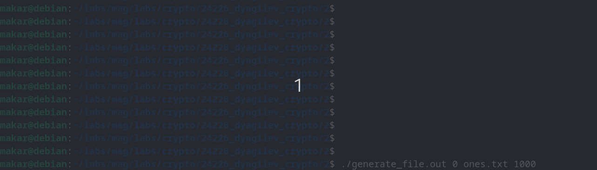

# Практическое задание 2

calc_entropy - программа для подсчёта частот появления символов и вычисления энтропии.
generate_file - программа для генерации файлов для задания.

Сборка - make

# Демонстрация - demo.gif

# Входы и выходы по пунктам

calc_entropy: вход - имя файла; выход - энтропия.
generate_file: вход - тип файла, который нужно сгенерировать (0 == "все единицы (как символы)", 1 == "случайные единицы и нули (как символы)", 2 = "половина единиц, затем половина случайных байт", 3 == "случайные байты"), имя выходного файла и его желаемая длина (из (0, 100000)); выход - файл.
