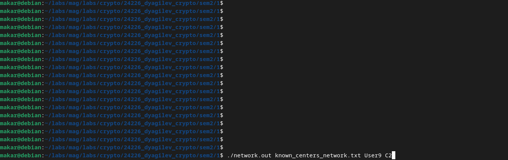

# Практическое задание 1

- hierarchical - для иерархической PKI
- network - для сетевой

Сборка - make

# Демонстрация - demo.gif

# Входы и выходы

Вход - имя файла, содержащего список известных сертификатов, и данные сертификата, который требуется проверить: имена владельца и удостоверяющего центра.

Выход - вердикт и цепочка доверия, если есть.
