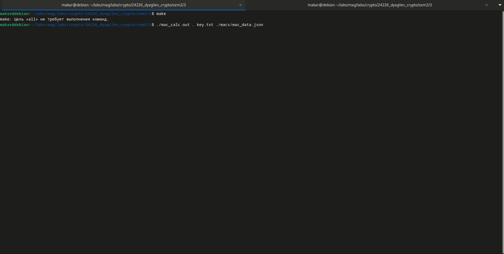

# Практическое задание 3

- mac_calc - вычисление MAC для файлов в папке
- mac_verify - проверка MAC для файлов в папке

Сборка - make

# Демонстрация - demo.gif

# Входы и выходы

- mac_calc: вход - пути до директории с файлами, которые нужно обработать, файла с ключом и выходного файла с вычисленными MAC; выход - JSON с вычисленными MAC.
- mac_verify: пути до директории с файлами, которые нужно обработать, файла с ключом и входного файла с вычисленными MAC; выход - результат проверки MAC.
